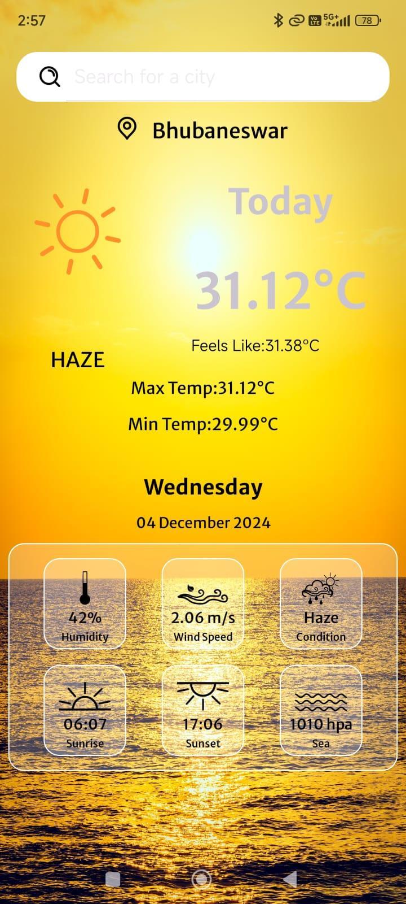
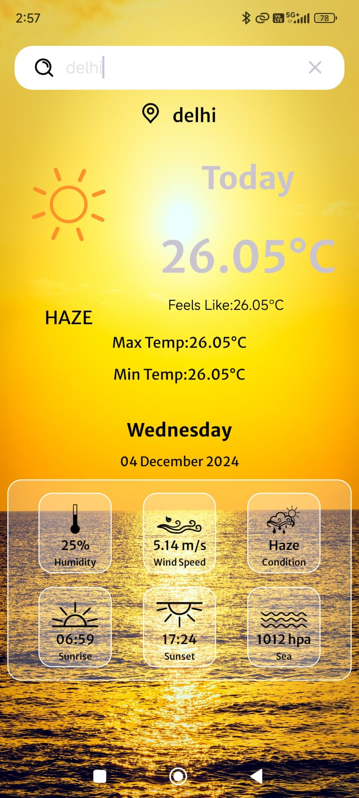
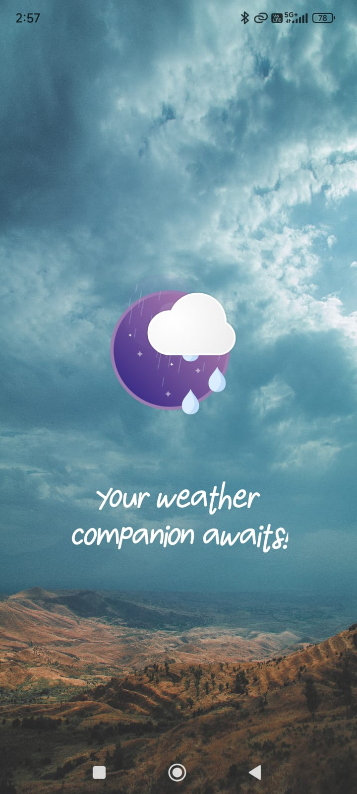

Weather App 🌤️

Welcome to the Weather App, a beautifully designed Android application that provides real-time weather information for your current location. Built with Android Studio, this app integrates a variety of tools to offer users a seamless experience with accurate weather data and engaging visuals.

🌟 Features
Real-Time Weather Updates: The app automatically detects your location and provides up-to-the-minute weather details for your area. Whether it's sunny, rainy, or cloudy, the app keeps you informed about the weather conditions in your vicinity.

Accurate Data with OpenWeather API: Weather data is fetched from the highly reliable OpenWeather API, ensuring you always get precise weather information, including temperature, humidity, wind speed, and more.

Retrofit for Secure API Communication: Data communication is handled securely using Retrofit, ensuring that the app exchanges information with the API in an encrypted format, safeguarding your data and enhancing performance.

Lottie Animations for Visual Appeal: Weather conditions are not just displayed in numbers—thanks to Lottie animations, the app provides visually stunning animations that represent various weather conditions (sunny, rainy, stormy, etc.) making the user experience more interactive and enjoyable.

Location-Based Services: By asking for location permissions, the app ensures that the weather data is tailored specifically to where you are, giving you relevant and up-to-date information.

Minimalist UI Design: The app is designed with simplicity in mind, allowing users to focus on the weather data without distractions. The intuitive layout and clear navigation ensure a user-friendly experience.

🛠️ Technology Stack

Android Studio: The app is developed in Java/Kotlin (depending on what you used) using Android Studio as the development environment.

OpenWeather API: Integrated for real-time weather updates.

Retrofit: Used for API encryption and secure communication between the app and the weather API.

Lottie Animation: Adds dynamic and smooth animations for different weather conditions, enhancing the user interface.

Fused Location API: Retrieves the user’s current location to deliver localized weather updates.

